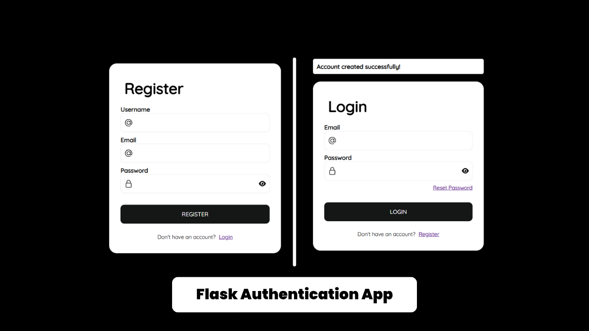

# FlaskAuth 🔐

A simple yet powerful user authentication system built with Flask. It includes login, registration, password reset, and a user dashboard. This app uses Flask-WTF for form handling, SQLAlchemy for database interactions, and Flask-Login for session management.

---
## 🔗 Preview

🌐 Live Preview: [https://flaskauth-a-simple-flask-authentication.onrender.com/login](https://flaskauth-a-simple-flask-authentication.onrender.com/login)




---
## 📁 Project Structure

```
flaskauth/
│
├── static/
│   └── style.css                # Stylesheet for UI
│
├── templates/
│   ├── base.html                # Base template with layout
│   ├── dashboard.html           # User dashboard
│   ├── login.html               # Login form
│   ├── register.html            # Registration form
│   └── reset.html               # Password reset form
│
├── app.py                       # Main Flask application
├── extensions.py                # Initialized Flask extensions
├── forms.py                     # WTForms for user input
├── models.py                    # SQLAlchemy models
├── README.md                    # Project documentation
├── requirements.txt             # Dependencies list
└── instance/                    # Folder for local settings like SQLite DB
```

---

## 🚀 Getting Started

### Requirements

- Python 3.10+
- pip

### Installation

1. Clone the repository

```bash
git clone https://github.com/codinggujarat/FlaskAuth-A-Simple-Flask-Authentication-App.git
cd FlaskAuth-A-Simple-Flask-Authentication-App
```

2. Create a virtual environment

```bash
python -m venv venv
source venv/bin/activate  # On Windows: venv\Scripts\activate
```

3. Install dependencies

```bash
pip install -r requirements.txt
```

4. Run the application

```bash
flask run
```

Visit: `http://127.0.0.1:5000`

---

## ⚙️ Configuration

If you're using the `instance/` folder for config, create a `config.py` file there:

```python
# instance/config.py
SECRET_KEY = 'your_secret_key_here'
SQLALCHEMY_DATABASE_URI = 'sqlite:///site.db'
```

Load it in `app.py`:

```python
app.config.from_pyfile('config.py')
```

---

## ✅ Features

- 🔐 Secure login and registration
- 🔄 Password reset form (logic optional)
- 💾 SQLite database with SQLAlchemy
- 🌐 Session management via Flask-Login
- 💡 Flash messages for feedback
- 🎨 Basic styling with CSS

---

## 🧪 Testing

Coming soon — add test cases for forms and routes.

---

## 🙋‍♂️ Contributing

Pull requests are welcome! Feel free to fork the repo and submit improvements.
